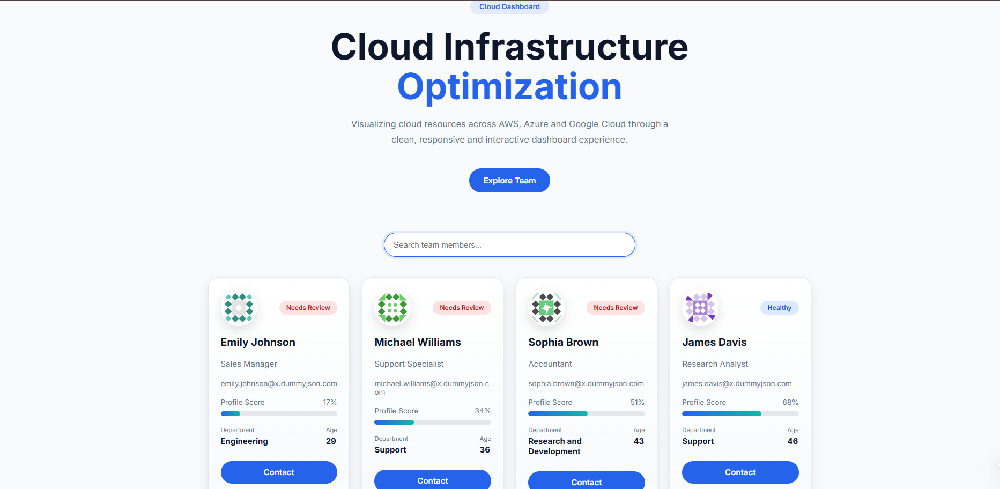

# Cloud Infrastructure Dashboard

A modern, responsive React application that visualizes cloud infrastructure providers using data fetched from the DummyJSON API. The application focuses on clean UI, smooth animations, reusable components, and responsive design.

---

## Application Preview



## Live Demo

> Add your Vercel deployment URL here after deployment.

Example:

https://your-project.vercel.app

---

## Features

- Responsive dashboard layout
- Search providers by name
- Loading skeletons while fetching data
- Error state handling
- Empty search state
- Animated cards using Framer Motion
- React Query for server state management
- TypeScript for type safety
- Modern and reusable component architecture

---

## Tech Stack

- React 19
- TypeScript
- Vite
- TanStack Query (React Query)
- Framer Motion
- CSS3

---

## Folder Structure

```text
src
│
├── api
│   └── api.ts
│
├── components
│   ├── AnimatedCard
│   ├── EmptyState
│   ├── ErrorState
│   ├── Footer
│   ├── Hero
│   ├── SearchBar
│   └── SkeletonCard
│
├── hooks
│   └── userProviders.ts
│
├── styles
│   └── globals.css
│
├── App.tsx
└── main.tsx
```

---

## Installation

Clone the repository

```bash
git clone https://github.com/vasamsaiteja/atomity-frontend-challenge.git
```

Navigate into the project

```bash
cd atomity-frontend-challenge
```

Install dependencies

```bash
npm install
```

Run the development server

```bash
npm run dev
```

Build for production

```bash
npm run build
```

Preview the production build

```bash
npm run preview
```

---

## Design Decisions

### React Query

React Query was used to manage server state, including loading, error, and caching behavior, while keeping the UI components clean.

### Component-Based Architecture

The application is divided into reusable components, making the codebase easier to maintain and extend.

### Framer Motion

Framer Motion was used to provide subtle animations that improve user experience without affecting performance.

### Responsive Design

CSS Grid and Flexbox are used throughout the application to ensure a responsive experience across desktop, tablet, and mobile devices.

---

## Error Handling

The application handles:

- Network request failures
- Loading state
- Empty search results

---

## Future Improvements

Given more time, the following enhancements could be added:

- Dark mode support
- Sorting and filtering options
- Pagination or infinite scrolling
- Provider details page
- Unit and integration tests
- Accessibility improvements (ARIA attributes, keyboard navigation)
- API abstraction layer with Axios

---

## Performance Optimizations

- React Query caching
- Reusable UI components
- CSS Grid responsive layout
- Framer Motion optimized animations
- TypeScript for compile-time safety

---

## Author

**Saiteja Vasamsetti**

Frontend Developer

GitHub:
https://github.com/vasamsaiteja

LinkedIn:
https://www.linkedin.com/in/vasamsaiteja/

---
